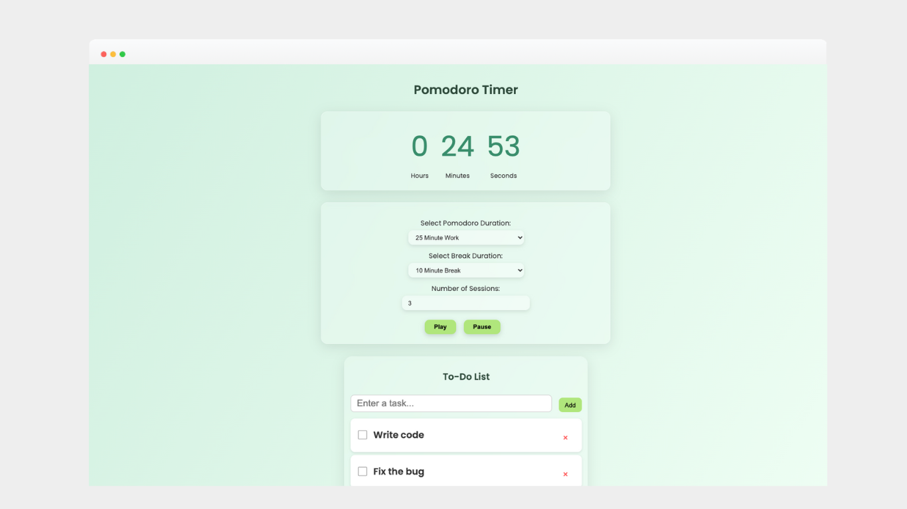

# ⏰ Pomo Timer 

A sleek and simple Pomodoro timer app designed to help you focus, stay organised, and boost productivity. Includes audio cues, customisable session lengths, and an integrated to-do list.

---

## 🛠️ Tech Stack

  
  

---

## ✨ Features

- **Custom Pomodoro Sessions**: Choose between 25-minute or 50-minute work sessions.

- **Break Time Options**: Pick 5-minute or 10-minute breaks between your work intervals.

- **Session Cycles**: Set the number of Pomodoro cycles you'd like to complete in one go.

- **Sound Notifications**: Ticking sound during active sessions and a ringing sound when a session ends

- **Play & Pause Controls**: Pause your timer at any time and resume when you're ready.

- **To-Do List Integration**  
  - Add tasks by pressing Enter or using the "Add" button  
  - Custom styled checkbox with a modern look  
  - Delete tasks with a simple "×" button

- **Live Countdown Display**: Dynamic display showing hours, minutes, and seconds left.
---

## 📦 How to Use

1. Clone or download the project files.
2. Open `index.html` in your browser.
3. Select session/break durations and desired cycle count.
4. Start the timer and manage your tasks!

---

## 📌 Coming Soon

- Dark mode toggle 🌙  
- Pomodoro session history 📊  
- Motivational quotes for each cycle 🔥  
- Mobile responsiveness 📱

---

## 💡 Inspiration

This project is inspired by the Pomodoro Technique — a time management method that encourages focused work sessions followed by short breaks.

